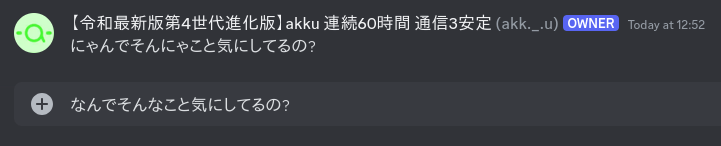
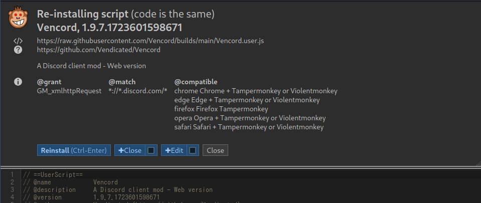
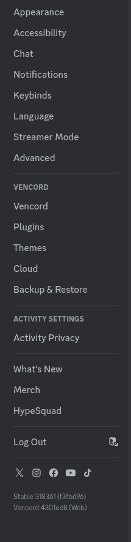
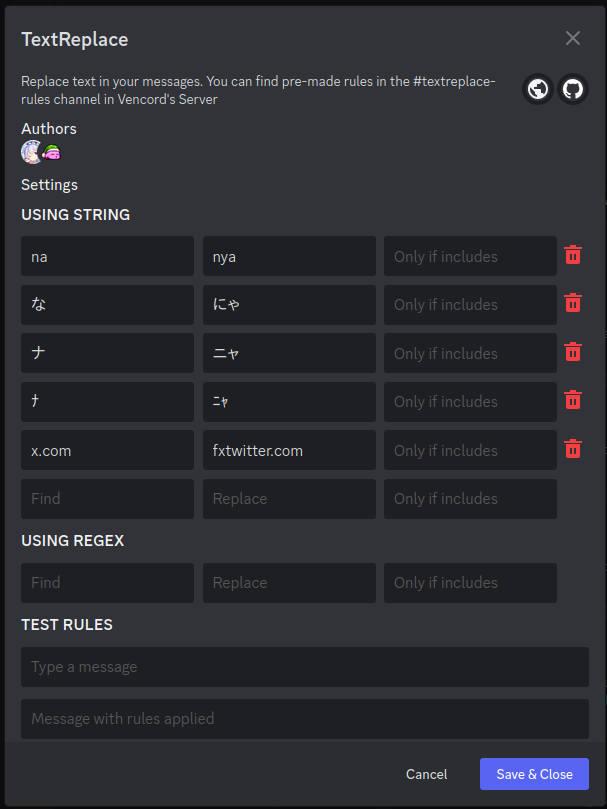

今回はDiscordで猫になる方法を解説します。

こんな感じになります。

では本編

## 1. Vencordを導入

まずはVencordを導入していきましょう。

わかっているとは思いますが、これは**Discordの利用規約違反**なので注意してください。

(非公式クライアントが原因でBanされた人は聞いたことが有りませんし、公式も黙認状態ですが...)

VencordはBetterDiscordと並ぶ有名なDiscord ModでBetterDiscordと比較して以下のような利点が有ります。

- BetterDiscordより軽い
- ブラウザ版Discordでも使える
- 公式提供されているプラグインの導入がとても簡単

逆にデメリットとしては

- 自作プラグインを入れるためにはVencordを自前でビルドしないといけない

という感じです。

兎にも角にも導入しましょう。

まずはVencordの公式サイトを開きます。

ロゴがkawaiiですね。 ダウンロードページにいきましょう。

https://vencord.dev/download/

お使いの環境に合わせてダウンロードしてください。

今回はブラウザ版の導入方法を解説します。

ブラウザ版ではブラウザの提供するセキュリティ機能によって外部リソースを使うテーマなどが動かないですが、
ほとんど困っていないので基本的には問題ないです。

> Please note that due to Discord's content security policy, the CSS Editor, custom themes and plugins making use of external scripts will not work with the Userscript.
>> Discord のコンテンツ セキュリティ ポリシーにより、外部スクリプトを使用する CSS エディター、カスタム テーマ、プラグインはユーザースクリプトでは動作しないことに注意してください。
>> By Google翻訳

導入方法は2通り。

- Chrome拡張機能
- ユーザースクリプト

私はユーザースクリプトで入れていますがどちらでもほぼ変わりません。

アップデートはユーザースクリプト版の方が早そうです。

### Chrome拡張機能版の入れ方

Chromium派生ブラウザを利用の方向けです。

[公式拡張機能ページ](https://chromewebstore.google.com/detail/vencord-web/cbghhgpcnddeihccjmnadmkaejncjndb)を開いてインストールするだけです。

https://chromewebstore.google.com/detail/vencord-web/cbghhgpcnddeihccjmnadmkaejncjndb

めっちゃ簡単。

### ユーザースクリプト版の入れ方

まずは何らかのユーザースクリプトマネージャを入れてください。

おすすめは[Violentmonkey](https://violentmonkey.github.io/)です。

https://violentmonkey.github.io/

#### Chromium系

公式では[Violentmonkey](https://chromewebstore.google.com/detail/violentmonkey/jinjaccalgkegednnccohejagnlnfdag)と[Tampermonkey](https://chromewebstore.google.com/detail/tampermonkey/dhdgffkkebhmkfjojejmpbldmpobfkfo)が推奨されているようです。

https://chromewebstore.google.com/detail/violentmonkey/jinjaccalgkegednnccohejagnlnfdag

https://chromewebstore.google.com/detail/tampermonkey/dhdgffkkebhmkfjojejmpbldmpobfkfo

Violentmonkeyは動作確認しました。

`chrome://extensions` で `*.user.js` というファイルをドラッグアンドドロップすればユーザースクリプトをインストールできますが、

多分アップデートを適応できないので良くないと思います。

#### Firefox系

公式は[Tampermonkey](https://addons.mozilla.org/en-US/firefox/addon/tampermonkey/)以外だと問題が発生するとされています。

https://addons.mozilla.org/en-US/firefox/addon/tampermonkey/

私の環境では[Violentmonkey](https://addons.mozilla.org/en-US/firefox/addon/violentmonkey/)で問題無く動いています。

https://addons.mozilla.org/en-US/firefox/addon/violentmonkey/

Pale Moonはよくわかりませんが、[GreasemonkeyのFork](https://github.com/janekptacijarabaci/greasemonkey/releases)が提供されているようです。

https://github.com/janekptacijarabaci/greasemonkey/releases

#### Safari

残念ながらSafariはサポートされていないようですが、[Safariでユーザースクリプトをサポートする拡張機能](https://apps.apple.com/jp/app/userscripts/id1463298887)が有りそうです。

https://apps.apple.com/jp/app/userscripts/id1463298887

私はApple製品を一つも持っていないため検証できませんが、試す価値はあると思います。

#### その他

[Greasemonkey](https://www.greasespot.net/)は使ったこともないし公式情報もないのでよくわかりません。

https://www.greasespot.net/

スマホでお使いの方については、

FirefoxならTampermonkeyとGreasemonkeyはAndroidでサポートされていました。

https://addons.mozilla.org/ja/android/

Chromium系なら拡張機能をサポートするForkが[いろいろあります](https://w.atwiki.jp/sumaho_browser/pages/33.html)が、Kiwi Browserが一番有名なのでおすすめします。

これで準備が調いました。

次に[Vencord.user.js](https://raw.githubusercontent.com/Vencord/builds/main/Vencord.user.js)を開いてください。

https://raw.githubusercontent.com/Vencord/builds/main/Vencord.user.js

すると下のような画面が出ると思います。

このスクリーンショットは再インストールとなっていますが気にしないでください。

そして、インストールボタンを押してください。

### インストールが終わりました。

**もしブラウザ版Discordを開いていたらリロードしてください**

また、稀にVencordがロードされないこともあるのでその時はもう一度リロードしてください。

完了です!

## 2. プラグインをセットアップ

Vencordが入ったので本題の猫モードをセットアップしましょう。

Discordのユーザー設定を開いてください。

スクロールしていくと見慣れない `Vencord` エリアがあると思います。

`Plugins` をクリックして、 `TextReplace` を検索してください。

トグルスイッチを押して緑色になったら有効です。

次に歯車アイコンを押してください。 プラグインの設定が開きます。

`USING STRING` のところに以下の設定をしてください。

| Find | Replace |
| --- | --- |
| `な` | `にゃ` |
| `ナ` | `ニャ` |
| `ﾅ` | `ﾆｬ` |
| `ｎａ` | `ｎｙａ` |

この機能は残念がらURLにも適応されてしまうため、

| Find | Replace |
| --- | --- |
| `na` | `nya` |

としてしまうと `https://www.gov.na/` は `https://www.gov.nya/` となってしまうためおすすめしません。

また、

| Find | Replace |
| --- | --- |
| `https://twitter.com/` | `https://fxtwitter.com/` |
| `https://x.com/` | `https://fxtwitter.com/` |

の置換を設定しておけば自動でTwitterがFxTwitterで見れるようになって嬉しいと思います。

以上。
