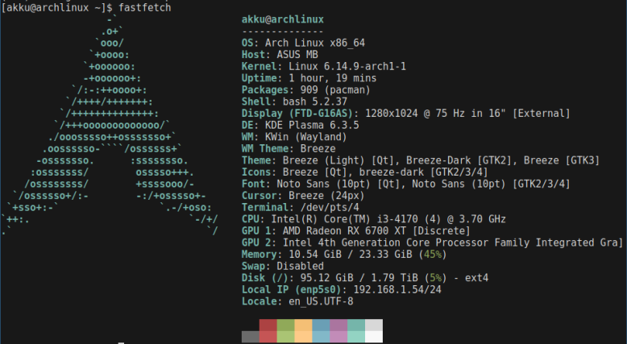

[半年以上前の記事](/blog/3rd-pc/)にて、パーツが余ったのでPCを組むという話をしていましたが、それを組んだところ起動しませんでした。

考えられる可能性は以下の通り

- マザボが駄目
- 電源が駄目
- グラボが壊れていて刺したらマザボごとやられた

原因がわからなかったので、すべての原因を交換しました。

というのは後付けで、ハードオフで `ASUS Dual Radeon™ RX 6700 XT 12GB` (`DUAL-RX6700XT-12G`) を即決(1万9800円)したからです。

結果的に新構成はこちら

```yaml
CPU: Core i3-4170
MEM: DDR3-1600 4GB x2 8GB x2 (24GB)
GPU: RX 6700 XT
HDD: 2TB (家に落ちてた)
Power: AcBel iPower85 550 (500W 80PLUS BRONZE)
Motherboard: ASUS B85M-E
```

Wi-Fiカードが無かったので(Mini PCIeスロットもない)、余っていた `Buffalo WHR-1166DHP2/N` を使ってWDSでWi-Fiを落としてきました。

最近は画像生成ばかりしています。

`ASUS Eee PC S101` はサブサブ機に降格ですが、当面サーバーやBotを動かすために使う予定です。

fastfetch



以上。


## 追記

ASUS製品多くね?


## 追記2

久しぶりにKDE Plasmaを入れました。

SwayWMのシンプルさとカスタム製は素晴らしいですが、Plasmaもなかなかかっこいいですね。
