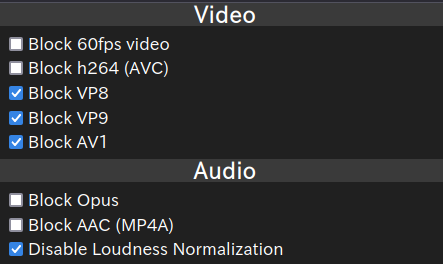
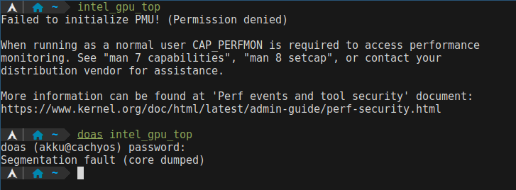
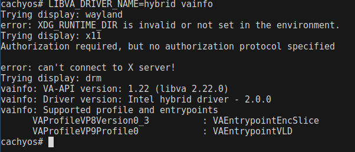

皆さん、あけましておめでとうございます。

2025年もよろしくお願いします。 akkuです。

今回は、Haswellの内蔵GPUでもハードウェアアクセラレーションをバリバリに働かせて動画を見たいネタです。

私は動画を見ることがかなり多いですから、その負荷が分散するのは良いことです。

特に、CPUはXMRigを動かしている関係上、負荷が少ないほうがハッシュレートが上がって嬉しいです。
(なお全く儲からない模様)

ということで現在の環境ですが、
[メインPCのCPUとメモリを交換しました](https://akku1139.github.io/blog/inspiron-upgrade-2/)
から変化は無いです。

ですから

---
CPU: Core i7-4770S (4400 yen)
GPU: Intel HD Graphics 4600 (CPU内蔵)
メモリ: 16GB (8GB *2) DDR3 (2200 yen)
---

となります。
(ところで、新年初ハードオフに行ったところ3850円の4770と4770Kがあったのはなにかの嫌がらせですか?)

4790Kがあったら買います。このマザボはH81なのでBroadwellは搭載できないのが残念。

## 現状

まずは `libva-utils` と `intel-gpu-tools` を導入します。

`libva-utils-2.22.0-1.1` `libprocps-3.3.17-4.1` `peg-0.1.19-1.1` `xorg-xrandr-1.5.3-1.1` `intel-gpu-tools-1.29-1` が入って 25.35MiB でした。

```
$ vainfo
Trying display: wayland
error: failed to resolve wl_drm_interface(): /usr/lib/libEGL_mesa.so.0: undefined symbol: wl_drm_interface
libva error: /usr/lib/dri/i965_drv_video.so init failed
vaInitialize failed with error code -1 (unknown libva error),exit

# doas vainfo
Trying display: wayland
error: XDG_RUNTIME_DIR is invalid or not set in the environment.
Trying display: x11
Authorization required, but no authorization protocol specified

error: can't connect to X server!
Trying display: drm
vainfo: VA-API version: 1.22 (libva 2.22.0)
vainfo: Driver version: Intel i965 driver for Intel(R) Haswell Desktop - 2.4.1
vainfo: Supported profile and entrypoints
      VAProfileMPEG2Simple            :	VAEntrypointVLD
      VAProfileMPEG2Simple            :	VAEntrypointEncSlice
      VAProfileMPEG2Main              :	VAEntrypointVLD
      VAProfileMPEG2Main              :	VAEntrypointEncSlice
      VAProfileH264ConstrainedBaseline:	VAEntrypointVLD
      VAProfileH264ConstrainedBaseline:	VAEntrypointEncSlice
      VAProfileH264Main               :	VAEntrypointVLD
      VAProfileH264Main               :	VAEntrypointEncSlice
      VAProfileH264High               :	VAEntrypointVLD
      VAProfileH264High               :	VAEntrypointEncSlice
      VAProfileH264MultiviewHigh      :	VAEntrypointVLD
      VAProfileH264MultiviewHigh      :	VAEntrypointEncSlice
      VAProfileH264StereoHigh         :	VAEntrypointVLD
      VAProfileH264StereoHigh         :	VAEntrypointEncSlice
      VAProfileVC1Simple              :	VAEntrypointVLD
      VAProfileVC1Main                :	VAEntrypointVLD
      VAProfileVC1Advanced            :	VAEntrypointVLD
      VAProfileNone                   :	VAEntrypointVideoProc
      VAProfileJPEGBaseline           :	VAEntrypointVLD
```

何故か一般ユーザーではエラーが発生したのでrootで行います。

(追記: `vainfo --display drm` ってしたら一般ユーザーでもうまく行った)

おそらく最も使われるのがH.264です。



現在は、[enhanced-h264ify](https://github.com/alextrv/enhanced-h264ify)を使って
VP8,9及びAV1の動画が降ってこないように設定しています。

ちなみに、 `intel_gpu_top` は...




## 挑戦

現在は、 `libva-intel-driver` によってハードウェアアクセラレーションを使用しています。

しかし、 `intel-hybrid-codec-driver-git` というドライバーがあるようです。

> Haswell Refresh から Skylake までの VP9 デコードと、Broadwell から Skylake までのハイブリッド VP8 エンコードは intel-hybrid-codec-driver-gitAUR によってサポートされています。
> [ArchWiki - ハードウェアビデオアクセラレーション#Intel](https://wiki.archlinux.jp/index.php/%E3%83%8F%E3%83%BC%E3%83%89%E3%82%A6%E3%82%A7%E3%82%A2%E3%83%93%E3%83%87%E3%82%AA%E3%82%A2%E3%82%AF%E3%82%BB%E3%83%A9%E3%83%AC%E3%83%BC%E3%82%B7%E3%83%A7%E3%83%B3#Intel)

([英語版の編集履歴](https://wiki.archlinux.org/index.php?title=Hardware_video_acceleration&diff=prev&oldid=576605)見たらHaswellでVP9デコードが壊れる的なこと書いてあって怖い)

> Haswell to Skylake hybrid VP8 encoding and, on some GPUs, VP9 decoding is supported by intel-hybrid-codec-driverAUR. Note: VP9 decoding is not supported on Haswell, but exposed by the driver. This confuses at least mpv, which, as a result, does single-threaded CPU-based decoding and drops a lot of frames on streams that it perfectly decodes without this driver.

とりあえず `intel-hybrid-codec-driver-git` を[auto-aur](https://akku1139.github.io/blog/auto-aur-released/)に追加したのでインストールしていきましょう。(追記: Chaotic-AURにあった)

インストールサイズは 5.08MiB です。



入りました。が、VP8とVP9しかサポートしてないとか聞いてないぞ()

> Required by (1)
>  libva-intel-driver-hybrid (requires intel-hybrid-codec-driver) (optional)

ビルドしてみよう!

多分 `hybrid_codec` ドライバーを有効にしたlibva-intel-driverのビルドをする必要があるようです。

と思いましたが、chaotic-aurにありました。やったね!

```
$ vainfo --display drm
Trying display: drm
vainfo: VA-API version: 1.22 (libva 2.22.0)
vainfo: Driver version: Intel i965 driver for Intel(R) Haswell Desktop - 2.4.1
vainfo: Supported profile and entrypoints
      VAProfileMPEG2Simple            :	VAEntrypointVLD
      VAProfileMPEG2Simple            :	VAEntrypointEncSlice
      VAProfileMPEG2Main              :	VAEntrypointVLD
      VAProfileMPEG2Main              :	VAEntrypointEncSlice
      VAProfileH264ConstrainedBaseline:	VAEntrypointVLD
      VAProfileH264ConstrainedBaseline:	VAEntrypointEncSlice
      VAProfileH264Main               :	VAEntrypointVLD
      VAProfileH264Main               :	VAEntrypointEncSlice
      VAProfileH264High               :	VAEntrypointVLD
      VAProfileH264High               :	VAEntrypointEncSlice
      VAProfileH264MultiviewHigh      :	VAEntrypointVLD
      VAProfileH264MultiviewHigh      :	VAEntrypointEncSlice
      VAProfileH264StereoHigh         :	VAEntrypointVLD
      VAProfileH264StereoHigh         :	VAEntrypointEncSlice
      VAProfileVC1Simple              :	VAEntrypointVLD
      VAProfileVC1Main                :	VAEntrypointVLD
      VAProfileVC1Advanced            :	VAEntrypointVLD
      VAProfileNone                   :	VAEntrypointVideoProc
      VAProfileJPEGBaseline           :	VAEntrypointVLD
      VAProfileVP9Profile0            :	VAEntrypointVLD
```

VP8どこ行った?

