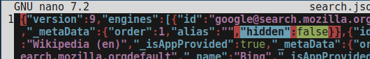

0. ブラウザの終了
1. mozlz4を落とす

   https://github.com/jusw85/mozlz4

2. プロファイルフォルダに移動 `cd ~/.cachy/[あなたのプロファイル]`
3. `mozlz4-linux search.json.mozlz4 search.json`
4. `vi search.json`
5. Googleの "hidden":true を "hidden":false に置き換え

   

7. `mozlz4-linux -z search.json search.json.mozlz4`
8. `rm search.json`
9. ブラウザを起動

   

以上。
